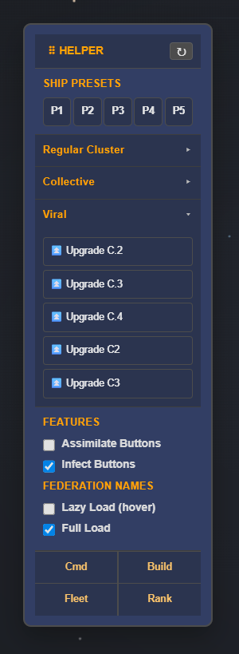
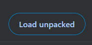

# GC Helper Tool

A small userscript / content script for the GC mod site that adds helper UI, quick actions, and live ship stats.



## Features

### 1. Auto-Explore & auto-continue
- Automatically clicks the in-game `Explore` button when the page loads if it can be found.
- Helps skip the manual exploration step.
- Automatically clicks the in-game `continue` button when the page loads if it can be found.(only when clustering)

### 2. Floating Helper Panel
- A draggable top-right helper panel.
- Includes:
  - `Refresh` button
  - `SHIP PRESETS`
  - `COLONY CLUSTER`
  - quick page shortcuts

### 3. Ship Presets
- Supports up to 5 preset buttons: `P1` through `P5`.
- Left-click a preset to auto-fill build inputs and submit a build request.
- Right-click a preset to save the current ship quantities into that preset.

### 4. Global Colony Cluster
- quick cluster upgrade buttons:
  - `Upgrade Lvl 1`
  - `Upgrade Lvl 2`
  - `Upgrade Lvl 3`
  - `similare c.2`
  - `similare c.3`
  - `similare c.4`
  - `similare c.5`
  - `tainted c.2`
  - `tainted c.3`
  - `tainted c.4`
- Each sends a cluster upgrade request using the current `sid`.

### 5. Link Sync
- The panel footer links are rewritten to include the session ID (`sid`).
- Links included:
  - `Cmd`
  - `Build`
  - `Fleet`
  - `Rank`

### 6. Drag and Drop Panel
- The helper panel can be dragged around the screen.
- Position is saved automatically.

### 7. Ship Hover Tooltips
- Hover over ship build links to display live tooltip stats.
- The tooltip includes:
  - Weapon stats
  - Defense mods
  - Other stats
  - Ship specials
- Tooltip content is fetched from the ship detail page when available.

### 8. Disband Table Quick Actions
- Adds three clickable quick-action cells to each disband row:
  - `10%`
  - `50%`
  - `All`
- These compute the value from the `In Fleet` cell and fill the `Disband` input automatically.

### 9. Quick Links
- added links to all navigation for battle and eco sims

### 10. New Ship Builder Controls

- Added `+5` and `+10` increment buttons to ship builder rows.
- Buttons now add `Rate × 5` or `Rate × 10` to the selected ship input.
- Styled batch buttons to match site UI:
  - green background `#145A32`
  - white text
  - `11.8px Arial, Helvetica, sans-serif` font

### 11. Quick Assimilate/infect 
- assimilate collective planets from the manage colonies screen.
- infect viral planets from the manage colonies screen.
- enable/disable this feature in the helper panel if you are not playing collective.

### 12. Federation Tags
- added federation names to ranking pages.

### 13. Federation Wars
- changed the colour of the attack button in rankings page to Green if the users federation is at war with your federation.

## Shortcuts & Controls

### Mouse controls
- `Right-click` on a preset button: save current ship values to that preset.
- `Left-click` on a preset button: apply saved preset to the ship build form.
- `Drag` the top panel title bar to move the panel.

### Buttons
- `↻ Refresh` — reloads the page.
- `P1...P5` — preset quick-access buttons.
- `⏫ Upgrade Lvl X` — perform a colony cluster upgrade.
- `Cmd`, `Build`, `Fleet`, `Rank` — site shortcuts with session sync.

## Installation
download: the GC Mod folder and extract somewhere.
1. Navigate to chrome://extensions/ 
2. Eanble Devoloper mode in the top right corner. 
3. Hit load unpacked 
4. Load the folder that you downloaded.
5. Head back to the game and refresh.

## Usage

1. Open the GC mod page.
2. Use the helper panel for quick actions.
3. Hover ship names to see tooltip stats.
4. On the disband table, click `10%`, `50%`, or `All` to fill the disband amount automatically.

## Notes

- The script uses the page `sid` to synchronize actions.
- Tooltip data is cached per ship detail URL.
- The disband quick cells rely on the table structure and the `input[name^="dis_"]` entries.

## Troubleshooting

- If tooltips do not appear, reload the page or verify the content script is enabled.
- If the disband table buttons do not show, check that the table class is `Default` and the disband inputs use `name="dis_*"`.
- If preset saving fails, ensure there are ship quantity inputs visible on the page.

## Example Markup / Usage
```html
<table class="Default">
  <tr class="Header">
    <td>Name</td>
    <td>Class</td>
    <td>Disband</td>
    <td>In Fleet</td>
    ...
  </tr>
  ...
</table>
